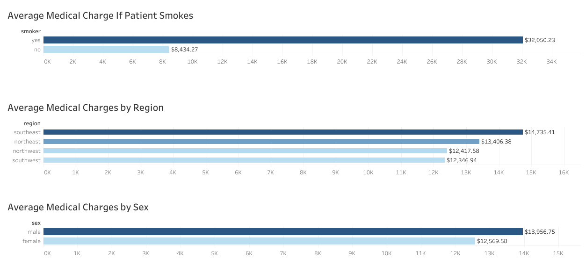
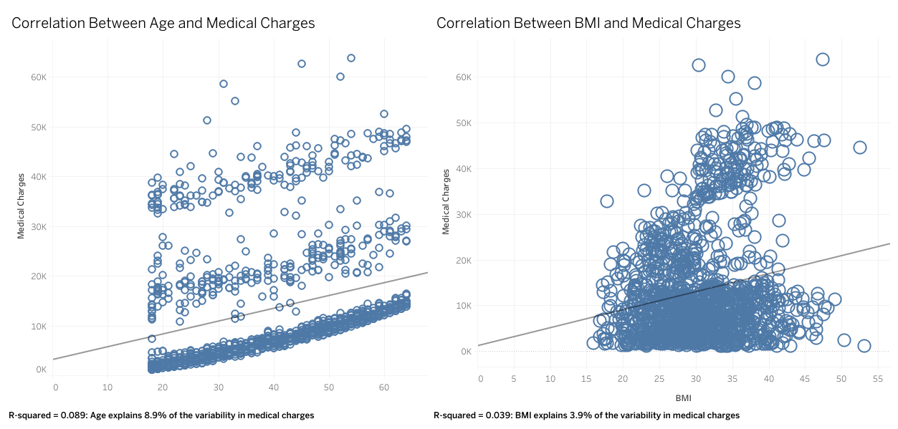

# MedicalChargesAnalysis

### Project Overview

The Medical Charges Analysis provides a comprehensive visualization and analysis of healthcare costs using the Medical Cost Dataset. This project aims to uncover key insights into the factors influencing medical charges.

### Steps Taken

1. **Data Import and Cleaning**: The dataset was imported into SQLite for initial data exploration and cleaning.
2. **Exploratory Data Analysis (EDA)**: Various SQL queries were executed to explore the dataset.
3. **Visualization**: The cleaned data was imported into Tableau for visualization.

### Tools and Technologies

- **SQLite**: Used for data import, cleaning, and executing SQL queries.
- **Tableau**: Employed for creating visualizations and building an interactive dashboard.

### Repository Contents

- **Data**: The raw and cleaned dataset.
- **SQL Scripts**: Scripts used for data cleaning and exploratory analysis.
- **Tableau Workbook**: The workbook containing all visualizations and the dashboard.

### Findings

1. Gender Disparity: Males typically spend over $1,000 more than females on medical charges, indicating potential gender-based differences in healthcare utilization.
2. Smoking Impact: Smoking greatly affects medical charges, with smokers incurring significantly higher costs (average for smokers: $32,000; average for non-smokers: $8,000), highlighting the importance of lifestyle factors in healthcare expenses.
3. Regional Variations: The southeast region tends to spend at least $1,000 more than any other region, suggesting regional disparities in healthcare expenditure.
4. BMI and Medical Expenses: BMI correlates with higher medical expenses, with obese individuals having the highest average charges ($15,479.55) compared to overweight, normal weight, and underweight individuals. However, the correlation is moderate, with an R squared value of only 3.9%.
5. Age and Medical Expenses: Average charges are correlated with age, increasing with higher age groups. However, the relationship is not very strong, with an R squared value of 8.9%.

### Recommendations
- Targeted Health Programs: Develop targeted health programs for males to address their higher medical expenses, focusing on preventive care and lifestyle interventions.
- Smoking Cessation Initiatives: Implement smoking cessation initiatives to reduce healthcare costs associated with smoking, offering support and resources for smokers looking to quit.
- Regional Cost Management: Implement cost management strategies in the southeast region to address the higher medical charges, such as improving healthcare efficiency and reducing unnecessary procedures.
- Age-Specific Health Services: Develop age-specific health services to address the increasing healthcare needs of older age groups, focusing on preventive care and chronic disease management.

